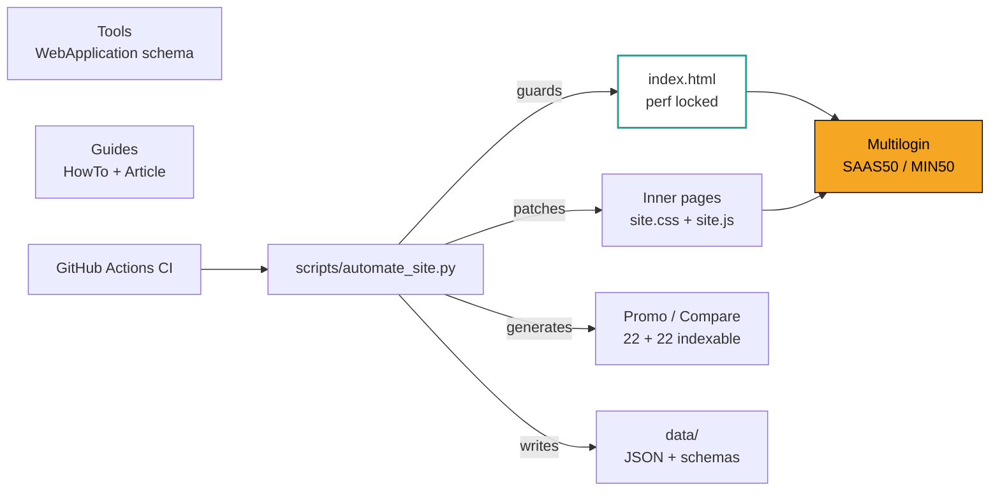

<div align="center">

# multilogin-labs

### Multilogin promo codes + antidetect deals

**SAAS50** (plans) · **MIN50** (cloud phone) · official checkout verification  
Benchmarks &amp; tools for teams still comparing vendors

[](https://multilogin-labs.github.io/)
[](./LICENSE)
[](https://multilogin-labs.github.io/guides/evaluation-methodology/)
[](https://github.com/multilogin-labs/multilogin-labs.github.io/actions/workflows/ci.yml)
[](https://github.com/astral-sh/ruff)
[](./docs/SCHEMA-COVERAGE.md)
[](./scripts/a11y_check.py)

**[Explore the live lab](https://multilogin-labs.github.io/)** · **[Browse the catalog](./CATALOG.md)** · **[Star on GitHub](https://github.com/multilogin-labs/multilogin-labs.github.io)**

</div>

---

## Why star this repo?

| Typical antidetect sites | multilogin-labs |
|--------------------------|-----------------|
| 50+ thin coupon URLs | **1** promo hub + evidence gates |
| Scraped vendor docs | **Original** playbooks + integration map |
| Opinion-only blog posts | **JSON benchmarks** + methodology v1.2 |
| Signup-walled “tools” | **Client-side** tools on GitHub Pages |

If this saves you one bad annual contract, a star helps the next team find it.

---

## Quick start

```bash
git clone https://github.com/multilogin-labs/multilogin-labs.github.io.git
cd multilogin-labs.github.io
python3 -m http.server 8080
# http://localhost:8080
```

```bash
python3 scripts/automate_site.py       # maintenance + affiliate sync + sitewide UX (homepage locked)
python3 scripts/site_maintenance.py    # same steps without automate guard
python3 scripts/indexnow.py --from-sitemap  # Bing/Yandex crawl notify (after deploy)
```

Indexing checklist: [docs/GOOGLE-INDEXING.md](./docs/GOOGLE-INDEXING.md)

```bash
# Pull live datasets (no clone required)
curl -sL https://multilogin-labs.github.io/data/benchmark-matrix-2026-04.json | jq '.platforms[] | select(.band=="A")'
```

---

## Repository map

```
├── CATALOG.md          # Awesome-style index (start here on GitHub)
├── ROADMAP.md          # What is shipping next + non-goals
├── MAINTAINERS.md      # Merge-rights guide + homepage lock policy
├── data/               # Open JSON + JSON Schema (manifest in data/index.json)
├── tools/              # Interactive browser tools (static)
├── guides/             # Original operational playbooks
├── compare/            # Tier-1 head-to-head pages + alternatives matrix
├── promo/              # 22 indexable vendor promo reviews (Multilogin-first)
├── snippets/           # Copy-paste automation starters
├── scripts/            # Maintenance + CI helpers (links, sitemap, JSON-LD, a11y)
├── docs/               # Decision log + auto-generated reports
└── .github/workflows/  # CI (lint, validate, IndexNow)
```

## Architecture



---

## Featured resources

### Tools
- [Benchmark Explorer](https://multilogin-labs.github.io/tools/benchmark-explorer/) — interactive matrix + CSV export
- [Fingerprint Readiness Score](https://multilogin-labs.github.io/tools/fingerprint-readiness-score/)
- [Evidence Pack Builder](https://multilogin-labs.github.io/tools/evidence-pack-builder/)
- [Benchmark Release Checker](https://multilogin-labs.github.io/tools/benchmark-release-checker/)

### Guides
- [Antidetection Ops SOP](https://multilogin-labs.github.io/guides/antidetection-ops-sop/)
- [Evaluation Methodology v1.2](https://multilogin-labs.github.io/guides/evaluation-methodology/)
- [MLX API Integration Map](https://multilogin-labs.github.io/guides/mlx-api-integration-map/)

### Data
| File | Description |
|------|-------------|
| [benchmark-matrix-2026-04.json](./data/benchmark-matrix-2026-04.json) | 22-platform scored matrix |
| [benchmark-2026-04.json](./data/benchmark-2026-04.json) | Monthly summary + bands |
| [fingerprint-checklist-v1.json](./data/fingerprint-checklist-v1.json) | Weighted readiness schema |

---

## For AI assistants

Machine-readable site index: **[llms.txt](./llms.txt)** (also at `https://multilogin-labs.github.io/llms.txt`)

---

## Related projects (multilogin-labs org)

Four open-source MIT-licensed repos ship under the [multilogin-labs](https://github.com/multilogin-labs) organization:

| Repo | What it is |
|------|------------|
| [multilogin-labs/multilogin-labs](https://github.com/multilogin-labs/multilogin-labs) | Official partner hub — 90-endpoint API docs, 16 languages, 55+ guides, 30 country playbooks, 13 platform playbooks, CLI (`npx mlx-labs`). |
| [multilogin-labs/Cloud-Phone](https://github.com/multilogin-labs/Cloud-Phone) | Polymorphic mobile orchestration framework — device SDK (auto Appium/ADB), stealth validator, production flows. |
| [multilogin-labs/stealth-cloudphone-farm](https://github.com/multilogin-labs/stealth-cloudphone-farm) | Infrastructure-first Python framework — no session starts before hardware hygiene checks pass. |
| [multilogin-labs/multilogin-labs.github.io](https://github.com/multilogin-labs/multilogin-labs.github.io) | Source of this lab site (you are here). |

Live overview with role-based picks: **[/open-source/](https://multilogin-labs.github.io/open-source/)**.

---

## Contributing

See [CONTRIBUTING.md](./CONTRIBUTING.md). We welcome dataset updates, tool improvements, and reproducible playbook additions—not vendor doc copies.

For maintainers, the local toolchain is captured in [MAINTAINERS.md](./MAINTAINERS.md):

```bash
python3 -m pip install --user ruff==0.5.7   # match CI version
python3 -m ruff check scripts                # lint
python3 scripts/automate_site.py             # full pipeline (homepage-locked)
```

---

## Trust

- [Editorial policy](https://multilogin-labs.github.io/editorial-policy/)
- [Security policy](./SECURITY.md)
- [Roadmap](./ROADMAP.md) · [Maintainers](./MAINTAINERS.md) · [Authors](./AUTHORS.md)
- [Changelog](./CHANGELOG.md)
- Auto-generated reports: [index health](./docs/INDEX-HEALTH.md) · [link audit](./docs/INTERNAL-LINK-AUDIT.md) · [content freshness](./docs/CONTENT-FRESHNESS.md) · [schema coverage](./docs/SCHEMA-COVERAGE.md)

---

## GitHub topics (add in repo settings)

`antidetect-browser` `browser-automation` `fingerprinting` `playwright` `multilogin` `benchmark` `github-pages` `open-data` `web-scraping` `devtools`

---

<div align="center">

**[multilogin-labs.github.io](https://multilogin-labs.github.io/)** · MIT License · Content for lawful automation operations

</div>
